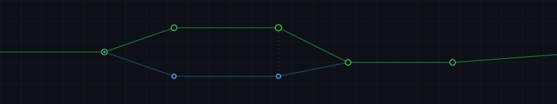

<!--======== HERO BANNER ========-->
<picture>
  <source media="(prefers-color-scheme: dark)" srcset="./public/hero-dark.svg">
  <source media="(prefers-color-scheme: light)" srcset="./public/hero-light.svg">
  
</picture>

<!--======== GRADIENT DIVIDER ========-->

<!--======== ANIMATED TYPING HEADER ========-->

  

 

  <samp>
    I engineer backend systems and data pipelines, focusing on deterministic performance, 
    memory safety, and fault tolerance within large-scale distributed architectures.
  </samp>

 

<!--======== GRADIENT DIVIDER ========-->

<!--======== CONTRIBUTION SNAKE ========-->

  <picture>
    <source
      media="(prefers-color-scheme: dark)"
      srcset="https://raw.githubusercontent.com/Ayush-kathil/Ayush-kathil/output/github-snake-dark.svg?v=3"
    />
    <source
      media="(prefers-color-scheme: light)"
      srcset="https://raw.githubusercontent.com/Ayush-kathil/Ayush-kathil/output/github-snake.svg?v=3"
    />
    
  </picture>

 

<!--======== GITHUB STATS ========-->

  <ul align="center">
    
<h2 style="display: inline-block; font-family: Inter, sans-serif"><samp>GITHUB ANALYTICS</samp></h2>

  </ul>

 

  
  

 

  

 

<!--======== GRADIENT DIVIDER ========-->

<!--======== TECH STACK ========-->

  <ul align="center">
    
<h2 style="display: inline-block; font-family: Inter, sans-serif"><samp>SYSTEMS & ARCHITECTURE STACK</samp></h2>

  </ul>

 

<h4><samp>Languages & Runtimes</samp></h4>

  

<h4><samp>Frameworks & Application Layer</samp></h4>

  

<h4><samp>Data Persistence & Messaging</samp></h4>

  

<h4><samp>Infrastructure & DevOps</samp></h4>

  

<h4><samp>ML & Data Science</samp></h4>

  

<h4><samp>Development Environment</samp></h4>

 

<!--======== GRADIENT DIVIDER ========-->

<!--======== UPSTREAM CONTRIBUTIONS ========-->

  <ul align="center">
    
<h2 style="display: inline-block; font-family: Inter, sans-serif"><samp>UPSTREAM OPEN SOURCE CONTRIBUTIONS</samp></h2>

  </ul>

 

<h3><samp>KUBEFLOW PIPELINES</samp> &nbsp;   </h3>

<i>Enterprise-grade Machine Learning Workflow Orchestration &mdash; CNCF Graduated Project</i>

<ul>
  <li><b>Memory Management & OOM Mitigation:</b> Engineered backend database payload defenses within the Go API server. Optimized <code>ListRuns</code> deserialization by dynamically stripping multi-megabyte pipeline execution manifests, drastically reducing database over-fetching and preventing node-level memory exhaustion (OOM panics) under high concurrency.</li>
  <li><b>Security Vulnerability Patching (CVE Prevention):</b> Architected mitigations for critical denial-of-service (DoS) attack vectors within the metrics parsing infrastructure, explicitly patching tarball traversal exploits and zip bomb vulnerabilities during artifact ingestion.</li>
  <li><b>Unit Test Engineering:</b> Rewrote and verified test assertions in <code>run_store_test.go</code> to ensure strict payload contract compliance after the OOM defense refactor.</li>
</ul>

<b>View Architecture Trade-offs & Post-Mortem</b>

 
<blockquote>
  <b>Post-Mortem Note:</b> The OOM mitigation required tracing nil pointer panics across the <code>api_converter.go</code> layer and overriding the Squirrel SQL query builder to inject mocked payload schemas. This safely bypassed expensive multi-megabyte JSON allocations while maintaining strict REST API contract compatibility with downstream orchestrators. <i>Trade-off: Increased code complexity in the data access layer to guarantee stable heap memory limits under production scale.</i>
</blockquote>

 

<h3><samp>KUBEFLOW KATIB</samp> &nbsp; </h3>

<i>Automated Machine Learning Infrastructure &mdash; Hyperparameter Tuning</i>

<ul>
  <li>Contributed to infrastructure stability by resolving validation pipeline bugs and enhancing test coverage for hyperparameter tuning controllers.</li>
</ul>

 

<!--======== GRADIENT DIVIDER ========-->

<!--======== HIGH-PERFORMANCE PROJECTS ========-->

  <ul align="center">
    
<h2 style="display: inline-block; font-family: Inter, sans-serif"><samp>HIGH-PERFORMANCE IMPLEMENTATIONS</samp></h2>

  </ul>

 

<!--======== PINNED REPOS ========-->

  
  

  
  

 

<!--======== PROJECT DEEP DIVES ========-->

<h3><samp>01 / CURA</samp> &nbsp;    </h3>

<i>Stateful RAG Architecture with Self-Correcting Generation Pipelines</i>

<ul>
  <li><b>State Machine Architecture:</b> Designed a self-correcting generation pipeline utilizing LangGraph to handle hallucination detection, forcing cyclic query rewrites until context validation passes.</li>
  <li><b>Database Indexing Strategy:</b> Implemented a hybrid search engine combining exact keyword BM25 matching with HNSW semantic vector search via <code>pgvector</code>, minimizing nearest-neighbor lookup latency.</li>
  <li><b>Memory Management:</b> Integrated context compression algorithms to strictly manage token limits and optimize language model throughput before re-ranking payloads.</li>
</ul>

<b>Architecture Trade-offs</b>

 
<blockquote>
  Chose complex cyclic state machines over linear chains to guarantee deterministic output accuracy, intentionally trading a slight increase in P99 latency for strict zero-hallucination verification on every query cycle.
</blockquote>

 

<h3><samp>02 / SFORA</samp> &nbsp; </h3>

<i>High-Performance File Automation with O(1) Memory Guarantees</i>

<ul>
  <li><b>Complexity:</b> Engineered an O(1) stream buffering deduplication engine utilizing native <code>java.nio</code>. Implemented SHA-256 cryptographic hashing on localized byte chunks to guarantee memory safety regardless of target file size.</li>
  <li><b>Concurrency & State:</b> Built a transactional, state-aware undo mechanism that logs localized file operations, allowing atomic rollbacks of large-scale directory mutations.</li>
  <li><b>Zero Dependencies:</b> Architected strictly using standard library Java 17 to bypass JVM bloat and external build dependencies.</li>
</ul>

 

<h3><samp>03 / CYBERIA</samp> &nbsp;   </h3>

<i>Applied ML Threat Analysis & Banking APK Forgery Detection</i>

<ul>
  <li><b>Multi-modal Pipeline:</b> Built an ingestion engine capable of parsing Android Application Packages (APK) in real-time alongside visual steganography analysis.</li>
  <li><b>Computer Vision:</b> Implemented OpenCV-based pixel anomaly detection for UI forgery identification on banking application surfaces.</li>
</ul>

 

<h3><samp>04 / RESUME-AI</samp> &nbsp;   </h3>

<i>Full-Stack AI Resume Builder with Real-Time Preview Engine</i>

<ul>
  <li><b>State Management:</b> Built with Zustand for zero-lag real-time preview rendering alongside generative AI for content rewriting.</li>
  <li><b>Auth & Security:</b> Integrated NextAuth.js with MongoDB backend and role-based access control for admin analytics.</li>
</ul>

 

<!--======== GRADIENT DIVIDER ========-->

<!--======== ACHIEVEMENTS ========-->

  <ul align="center">
    
<h2 style="display: inline-block; font-family: Inter, sans-serif"><samp>VERIFIED ACHIEVEMENTS</samp></h2>

  </ul>

 

<ul>
  <li><code>[2026]</code> &nbsp; <b>Software Engineering Intern</b> &mdash; HackerRank &nbsp; </li>
  <li><code>[2026]</code> &nbsp; <b>Open Source Contributor</b> &mdash; GSSoC (DevPath) &nbsp; </li>
  <li><code>[2026]</code> &nbsp; <b>Published Indian Patent Application</b> &mdash; VIT Bhopal University</li>
  <li><code>[2025]</code> &nbsp; <b>Google Cloud Generative AI Certification</b> &nbsp; </li>
  <li><code>[2025]</code> &nbsp; <b>Applied Machine Learning in Python</b> &mdash; University of Michigan &nbsp; </li>
</ul>

 

<!--======== ENGINEERING LOGS ========-->

<b><samp>ENGINEERING LOGS & RFCs</samp></b>

 
<ul>
  <li><code>[2026-09]</code> &nbsp; <b>Architecture Review:</b> Mitigating API Server OOM Panics in Go (<a href="https://github.com/kubeflow/pipelines">kubeflow/pipelines</a>)</li>
  <li><code>[2026-08]</code> &nbsp; <b>System Design:</b> Cyclic State Machines for Hallucination Detection in RAG Pipelines</li>
  <li><code>[2026-07]</code> &nbsp; <b>Security Patch:</b> Preventing Tarball Traversal & Zip Bomb Attacks in CI/CD Artifacts</li>
  <li><code>[2026-06]</code> &nbsp; <b>Performance:</b> O(1) Memory-Safe Stream Deduplication with SHA-256 Hashing</li>
</ul>

 

<!--======== GRADIENT DIVIDER ========-->

<!--======== CONNECT ========-->

  <ul align="center">
    
<h2 style="display: inline-block; font-family: Inter, sans-serif"><samp>CONNECT</samp></h2>

  </ul>

 

   &nbsp;&nbsp;
   &nbsp;&nbsp;
   &nbsp;&nbsp;
   &nbsp;&nbsp;
   &nbsp;&nbsp;
  

 
 

<!--======== GRADIENT DIVIDER ========-->

 

  <a href="#top"><code>[ Return to Top ]</code></a>

 
