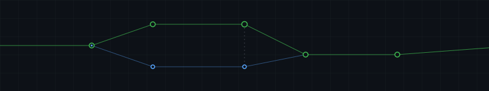

<picture>
  <source media="(prefers-color-scheme: dark)" srcset="./public/hero-dark.svg">
  <source media="(prefers-color-scheme: light)" srcset="./public/hero-light.svg">
  
</picture>

# Ayush Gupta

**Software Engineer & ML Systems**  
*I engineer backend systems, data pipelines, and responsive frontends, focusing on deterministic performance, memory safety, and elegant user interfaces.*

[Portfolio](https://ayushgupta3.vercel.app) · [LinkedIn](https://www.linkedin.com/in/ayushkathil) · [Email](mailto:kathilshiva@gmail.com)

---

## ✦ Open Source Engineering

**Kubeflow Pipelines (CNCF Graduated)**
*Enterprise-grade Machine Learning Workflow Orchestration*

* **Memory Management & OOM Mitigation:** Engineered backend database payload defenses within the Go API server. Optimized `ListRuns` deserialization by dynamically stripping multi-megabyte pipeline execution manifests, drastically reducing database over-fetching and preventing node-level memory exhaustion (OOM panics).
* **CVE Prevention:** Architected mitigations for critical DoS attack vectors within the metrics parsing infrastructure, explicitly patching tarball traversal exploits and zip bomb vulnerabilities.

<b>View Architecture Trade-offs</b>

 

> **Post-Mortem Note:** The OOM mitigation required tracing nil pointer panics across the `api_converter.go` layer and overriding the Squirrel SQL query builder to inject mocked payload schemas. This safely bypassed expensive multi-megabyte JSON allocations while maintaining strict REST API contract compatibility. *Trade-off: Increased code complexity in the data access layer to guarantee stable heap memory limits under production scale.*

**Kubeflow Katib**
*Automated Machine Learning Infrastructure*

* **Controller Stability:** Resolved validation pipeline bugs and enhanced test coverage for hyperparameter tuning controllers.

---

## ✦ Selected Work

### 01 / [CURA: Stateful RAG Architecture](https://github.com/Ayush-kathil/cura-assistant-RAG)
*Self-Correcting Generation Pipelines*
* **Architecture:** Designed a self-correcting generation pipeline utilizing LangGraph to handle hallucination detection, forcing cyclic query rewrites until context validation passes.
* **Database Indexing:** Implemented a hybrid search engine combining exact keyword BM25 matching with HNSW semantic vector search via `pgvector`.
* **Stack:** Next.js, Python, PostgreSQL, Supabase.

### 02 / [SFORA: O(1) Memory Engine](https://github.com/Ayush-kathil/SFORA-Smart-File-Organizer)
*High-Performance File Automation*
* **Concurrency:** Engineered an O(1) stream buffering deduplication engine utilizing native `java.nio`. 
* **State Management:** Built a transactional, state-aware undo mechanism that logs localized file operations, allowing atomic rollbacks of large-scale directory mutations.
* **Stack:** Java 17 (Zero Dependency).

### 03 / [Cyberia: Applied ML Threat Analysis](https://github.com/Ayush-kathil/Cyberia---Detecting-Fake-Banking-APKs)
*Banking APK Forgery Detection*
* **Multi-modal Pipeline:** Built an ingestion engine capable of parsing Android Application Packages (APK) in real-time alongside visual steganography analysis.
* **Computer Vision:** Implemented OpenCV-based pixel anomaly detection for UI forgery identification.
* **Stack:** Python, OpenCV, TensorFlow.

### 04 / [AI Resume Builder](https://github.com/Ayush-kathil/resume-builder)
*Full-Stack Platform with Real-Time Previews*
* **State Management:** Built with Zustand for zero-lag real-time preview rendering alongside generative AI for content rewriting.
* **Security:** Integrated NextAuth.js with MongoDB backend and role-based access control.
* **Stack:** Next.js, MongoDB, Tailwind.

---

## ✦ Technical Toolkit

| Domain | Core Technologies |
| :--- | :--- |
| **Languages** | Go, Python, TypeScript, Java, C++, Bash |
| **Frameworks** | Next.js, React, Node.js, FastAPI, Flask |
| **Databases** | PostgreSQL (pgvector), MongoDB, Redis, Kafka |
| **Infrastructure** | Kubernetes, Docker, AWS, GitHub Actions |
| **ML & Data** | PyTorch, TensorFlow, OpenCV |

---

## ✦ Verified Achievements

* `[2026]` **Software Engineering Intern** — HackerRank
* `[2026]` **Open Source Contributor** — GSSoC (DevPath)
* `[2026]` **Published Indian Patent Application** — VIT Bhopal University
* `[2025]` **Google Cloud Generative AI Certification** 
* `[2025]` **Applied Machine Learning in Python** — University of Michigan (Coursera)

---

  
<i>Building reliable systems and refined interfaces.</i>

  <a href="https://ayushgupta3.vercel.app"><b>View Interactive Portfolio</b></a>

